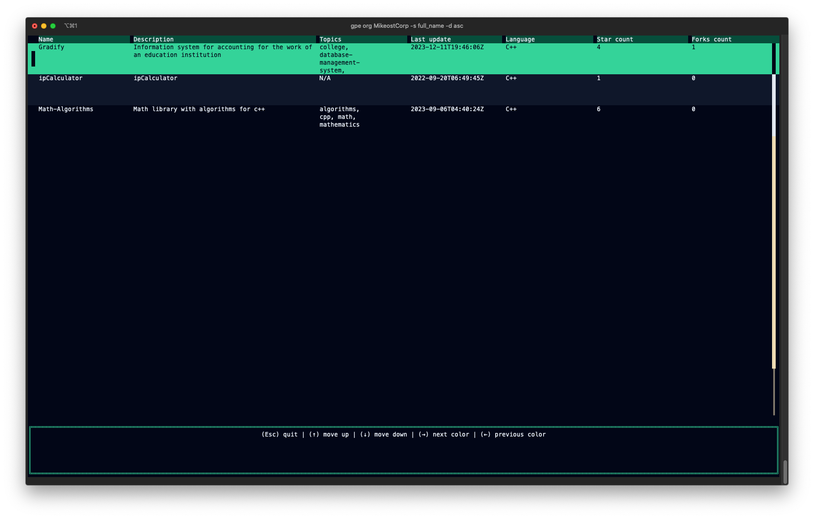

# GitHub Profile Explorer

<p align="center">
  <a href="#github-profile-explorer"></a>
</p>

<p align="center">
  <a href="https://github.com/Mikeost/github-profile-explorer/actions/workflows/rust.yml"></a>
  <a href="https://github.com/Mikeost/github-profile-explorer?tab=MIT-1-ov-file#readme"></a>
  
  <a href="https://app.codacy.com/gh/Mikeost/github-profile-explorer/dashboard?utm_source=gh&utm_medium=referral&utm_content=&utm_campaign=Badge_grade"></a>
  
  
  
</p>

## Description

GitHub Profile Explorer is a command-line interface tool that allows you to retrieve public information about GitHub users, organizations, and repositories directly from your terminal. It provides features such as fetching user details, listing repositories, and more, making it convenient for users who prefer a command-line environment for GitHub exploration.

## Features

- Fetch public details about GitHub users and organizations.
- List repositories and their details.
- Performing various actions through a simple, elegant terminal interface.

## Usage

Install:

```bash
git clone https://github.com/Mikeost/github-profile-explorer.git
cd github-profile-explorer
cargo install --path .
```

Run program:

```bash
gpe <REQUEST> <NAME> [OPTIONS]
```

| Argument | Command | Description |
| ------ | ------- | ----------- |
| Request | `org`, `user` | Retrieve information about a GitHub organization/user |
| Name | `name` | The corresponding GitHub organization/user name you want to explore |

<hr>

| Option | Command | Description |
| ------ | ------- | ----------- |
| Sort | `-s, --sort <SORT>` | The property to sort the results by (created/updated/pushed/full_name) [default: created] |
| Direction | `-d, --direction <DIRECTION>` | The order to sort by (asc/desc) [default: desc] |
| Help | `-h, --help` | Print help |
| Verion | `-V, --version` | Print version |

## Interface control

| Command | Description |
| ------- | ----------- |
| `Esc` | Quit the program |
| `↑` | Move selection up |
| `↓` | Move selection down |
| `→` | Switch to the next color scheme |
| `←` | Switch to the previous color scheme |

## Examples

### Example of retrieve information about a GitHub user

<details>
  <summary>Click to expand!</summary>

```bash
gpe user Mikeost -s pushed -d desc
```


</details>

### Example of retrieve information about a GitHub organization

<details>
  <summary>Click to expand!</summary>

```bash
gpe org MikeostCorp -s full_name -d asc
```



</details>